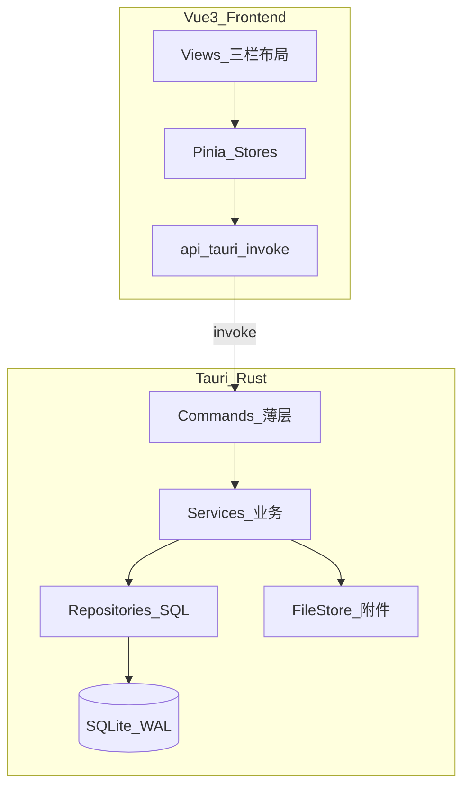
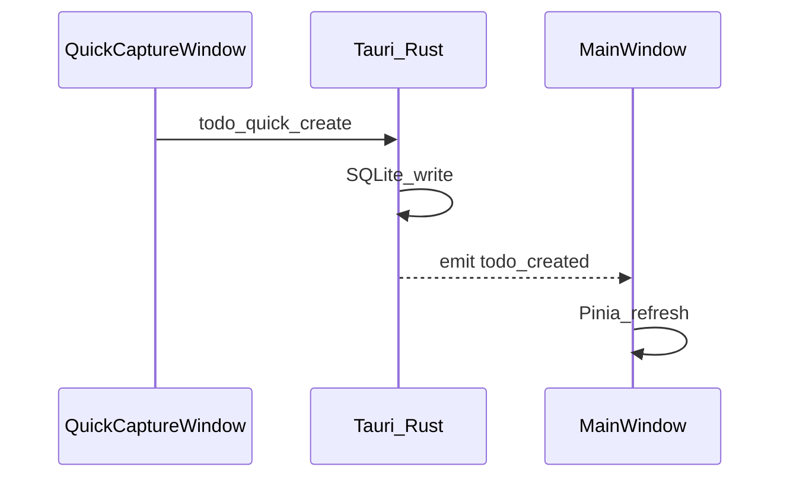

# Todo List 实现规划（v1.0 核心版：Phase 1–4）

## 交付边界

| 版本          | 范围       | 验收标准                                                                                      |
| ------------- | ---------- | --------------------------------------------------------------------------------------------- |
| **v1.0 核心** | Phase 1–4  | 可日常使用的三栏 Todo：分类/标签/任务 CRUD、富文本+图片、FTS 搜索、快捷创建、托盘/快捷键/通知 |
| 后续 v1.x     | Phase 5–10 | 主题、备份、子任务、重复任务等（本计划仅列里程碑，不展开实现）                                |

当前仓库仅有 [README.md](d:\workspaces\tauri_workspaces\todo-list\README.md)，无代码，需从零脚手架。

---

## 总体架构



**关键架构决策（Phase 1 前定稿，避免返工）：**

- **无独立后端服务**：Rust 内嵌于 Tauri 进程，前端仅 `invoke` + `listen`
- **分层**：`commands/` 薄封装 → `services/` 业务 → `db/repositories/` SQL
- **DB 单例 + Mutex**：应对 Phase 4 多窗口（主窗口 + 快速捕获窗）并发写
- **列表/详情 API 分离**：列表接口不返回 `content_html`，详情接口才加载富文本
- **附件时序**：新建任务时先 `INSERT` 拿 `todo_id`，再允许粘贴图片（避免无 id 目录问题）
- **FTS 修正**：在 `todos` 表增加 `tags_text` 冗余列 + 触发器同步 FTS5（README 中 `tags_text` 不在源表，需补齐）
- **中文搜索**：Rust 侧 `jieba-rs` 分词后写入 FTS（空格 join token）
- **迁移机制**：`schema_migrations` 表 + 版本化 SQL 文件，Phase 1 只建 v1 核心表，扩展表后续迁移追加
- **富文本安全**：TipTap 输出经 DOMPurify 白名单消毒后再存库/渲染
- **时间约定**：`due_date` 存 ISO 本地日期 `YYYY-MM-DD`；提醒/通知 Phase 4 再存 UTC 时间戳

---

## 目标目录结构

```
todo-list/
├── README.md
├── package.json
├── vite.config.ts
├── src/                          # Vue 前端
│   ├── main.ts
│   ├── App.vue
│   ├── router/index.ts
│   ├── stores/                   # Pinia: todo, category, tag, ui, settings
│   ├── api/                      # invoke 封装 + TS 类型
│   ├── types/                    # 与 README 接口对齐
│   ├── views/
│   │   ├── MainView.vue          # 三栏主界面
│   │   └── QuickCaptureView.vue  # Phase 4 快速捕获小窗
│   ├── components/
│   │   ├── layout/               # Sidebar, TaskList, TaskDetail
│   │   ├── todo/                 # TodoItem, QuickInput, TodoEditor
│   │   ├── category/
│   │   ├── tag/
│   │   └── editor/               # TipTapEditor (Phase 2)
│   ├── composables/              # useAutoSave, useSearch, useUndoDelete
│   └── styles/                   # design tokens, 主题变量预留
└── src-tauri/
    ├── Cargo.toml
    ├── tauri.conf.json
    ├── capabilities/             # Tauri 2 权限
    └── src/
        ├── main.rs / lib.rs
        ├── commands/               # todo, category, tag, attachment, search
        ├── services/
        ├── db/
        │   ├── mod.rs
        │   ├── pool.rs             # 单例连接 + WAL
        │   ├── migrations/         # 001_init.sql, 002_fts.sql ...
        │   └── repositories/
        ├── file_store/             # attachments 读写
        └── error.rs                # 统一 AppError 错误码
```

---

## Phase 1：骨架 + 核心 CRUD + 三栏 UI + 快速输入

**目标**：应用可启动，数据持久化，三栏布局可用，主界面快速创建任务。

### 1.1 项目初始化

- `npm create tauri-app@latest` 选 Vue + TypeScript + Vite
- 安装：`element-plus`、`@element-plus/icons-vue`、`pinia`、`vue-router`
- Tauri 2 配置：`app_data_dir` 路径、窗口最小宽 900px、单实例插件（Phase 4 前可先预留）
- Rust 依赖：`rusqlite`（bundled）、`serde`、`chrono`、`thiserror`

### 1.2 数据库 v1 迁移（仅核心表）

Phase 1 一次性创建：

- `schema_migrations`
- `categories`、`tags`、`todos`（含 `pinned`、`recurrence_json` 字段但 UI 暂不用）、`todo_tags`
- 索引：`todos(category_id)`、`todos(deleted_at)`、`todos(completed)`、`todos(due_date)`

**暂不建**：FTS、attachments、subtasks 等扩展表（Phase 2/3 迁移追加）。

### 1.3 Rust 后端

| Command                                       | 职责                                       |
| --------------------------------------------- | ------------------------------------------ |
| `category_*`                                  | list / create / update / delete / reorder  |
| `tag_*`                                       | list / create / update / delete            |
| `todo_list`                                   | 分页/筛选列表（摘要字段，无 HTML）         |
| `todo_get`                                    | 单条详情（含 content_html、tag_ids）       |
| `todo_create` / `todo_update` / `todo_delete` | CRUD                                       |
| `todo_toggle_complete`                        | 切换完成状态                               |
| `todo_quick_create`                           | 快捷创建（title + category_id + priority） |

- 软删除：`deleted_at` 非空即进回收站
- 事务：创建/更新任务 + 标签关联在同一 transaction

### 1.4 Vue 前端

- **MainView 三栏布局**：`Sidebar` | `TaskListPanel` | `TaskDetailPanel`
- **Sidebar**：全部任务、分类列表（含计数）、标签列表（点击 OR 筛选）、设置入口占位
- **TaskListPanel**：搜索框占位、**QuickInputBar**（Enter 创建、Shift+Enter 创建并选中详情）
- **TaskDetailPanel**：标题、分类选择、标签多选、优先级、截止日期、占位编辑器区
- **Pinia stores**：`useCategoryStore`、`useTagStore`、`useTodoStore`、`useUiStore`（当前选中分类/标签/任务）
- **自动保存**：详情区 debounce 800ms 调用 `todo_update`（Phase 1 仅 plain text/空 HTML）

### 1.5 Phase 1 验收

- [ ] `npm run tauri dev` 可启动
- [ ] 分类/标签/任务 CRUD 重启后数据仍在
- [ ] 三栏联动：点分类/标签过滤列表，点任务显示详情
- [ ] 快速输入栏 Enter 创建、Shift+Enter 打开详情
- [ ] 软删除 + 5 秒撤销 Toast
- [ ] 完成/未完成分组或筛选

**预估工作量**：3–5 天

---

## Phase 2：TipTap 富文本 + 图片附件

**目标**：任务详情支持富文本编辑；图片粘贴/拖拽/插入；附件落盘。

### 2.1 数据库迁移 v2

- `attachments` 表（增加 `original_name`、`kind`: inline/file）
- 迁移脚本 `002_attachments.sql`

### 2.2 Rust 文件存储

```
app_data_dir/
├── todos.db
└── attachments/{todo_id}/{uuid}.{ext}
```

| Command             | 职责                                                       |
| ------------------- | ---------------------------------------------------------- |
| `attachment_save`   | 接收 bytes → 写文件 → 写 attachments 记录 → 返回 asset URL |
| `attachment_delete` | 删文件 + 记录                                              |
| `attachment_list`   | 按 todo_id 列出                                            |

- Tauri 2 注册 `asset` 或自定义 protocol 供 `` 加载
- 路径校验：禁止 `..` 目录遍历
- 删除任务：事务内软删 + 删除 attachments 目录

### 2.3 TipTap 集成

- 包：`@tiptap/vue-3`、`starter-kit`、`extension-image`、`extension-link`
- 工具栏：加粗/斜体/标题/列表/引用/代码/链接/插入图片
- 粘贴/拖拽图片 → `attachment_save` → 插入返回 URL
- 保存时：HTML → DOMPurify → `content_html`；剥离纯文本 → `content_text`
- **流程**：选中/创建任务后先确保有 `todo_id`，再允许图片上传

### 2.4 Phase 2 验收

- [ ] 富文本格式可保存并重新打开
- [ ] 粘贴/拖拽/选择图片均可显示
- [ ] 图片不在 SQLite 内（仅 HTML 引用）
- [ ] 删除任务后附件目录清理

**预估工作量**：3–4 天

---

## Phase 3：FTS 全文搜索 + 组合筛选

**目标**：实时搜索标题/正文/标签；与分类/标签/状态组合；关键词高亮。

### 3.1 数据库迁移 v3

- `todos` 表增加 `tags_text TEXT DEFAULT ''`
- FTS5 虚拟表 + 触发器（INSERT/UPDATE/DELETE 同步）
- 分词：写入/更新时 Rust 用 `jieba-rs` 生成 `content_text`（若 Phase 2 已做则复用）和 `tags_text`

**搜索策略：**

- FTS：`title`、`content_text`、`tags_text`（MATCH + bm25 排序）
- 分类名：JOIN `categories` + LIKE（非 FTS）
- 组合：`deleted_at IS NULL` + category_id + tag_ids + completed + FTS 条件

### 3.2 Rust

| Command       | 职责                                          |
| ------------- | --------------------------------------------- |
| `todo_search` | query + filters → 摘要列表 + match 信息供高亮 |

### 3.3 Vue

- 搜索框 debounce 300ms
- 列表标题/摘要 `<mark>` 高亮
- 筛选栏：状态（全部/未完成/已完成）、优先级
- Sidebar 标签点击 + 搜索框同时生效

### 3.4 Phase 3 验收

- [ ] 中文关键词可搜到标题和正文
- [ ] 标签名可搜到对应任务
- [ ] 搜索 + 分类 + 标签 + 状态组合正确
- [ ] 结果关键词高亮

**预估工作量**：2–3 天

---

## Phase 4：桌面特性（快捷捕获 + 托盘 + 通知 + 窗口记忆）

**目标**：全局快捷键快速添加；托盘常驻；截止日期通知；多窗口数据同步。

### 4.1 设置持久化

- 迁移 v4：`settings` 表或 `settings.json`（键值对）
- 存储：窗口位置/大小、全局快捷键、默认分类、创建后行为

### 4.2 多窗口架构



- 快速捕获窗：480×120、alwaysOnTop、单行输入 + 分类下拉
- 全局快捷键：`Ctrl+Shift+N`（`tauri-plugin-global-shortcut`）
- 单实例：`tauri-plugin-single-instance`
- 系统托盘：未完成数 Badge、右键「快速添加」、退出
- 数据变更 Event：`todo-created`、`todo-updated`、`todo-deleted` 广播各窗口

### 4.3 提醒与通知

- Phase 4 最小实现：`due_date` 当天启动/定时检查 → `tauri-plugin-notification`
- 应用需托盘常驻或启动时补偿遗漏提醒（README 提醒表 Phase 7 再做，v1.0 仅 due_date 当日通知）

### 4.4 内联创建（可选，Phase 4 内）

- 列表顶部「点击添加任务…」行

### 4.5 Phase 4 / v1.0 验收

- [ ] 全局快捷键弹出快速捕获，Enter 创建
- [ ] 托盘显示未完成数，可快速添加
- [ ] 主窗口与快速捕获窗列表同步
- [ ] 窗口大小/位置重启后恢复
- [ ] 到期任务桌面通知
- [ ] 单实例：重复打开聚焦已有窗口

**预估工作量**：4–5 天

---

## v1.0 总排期（估算）

| Phase    | 内容                          | 天数         |
| -------- | ----------------------------- | ------------ |
| 1        | 骨架 + CRUD + 三栏 + 快速输入 | 3–5          |
| 2        | TipTap + 附件                 | 3–4          |
| 3        | FTS 搜索                      | 2–3          |
| 4        | 桌面特性                      | 4–5          |
| **合计** | **v1.0 核心**                 | **12–17 天** |

---

## 后续版本路线图（Phase 5–10，暂不实现）

| 版本 | Phase | 重点                                        |
| ---- | ----- | ------------------------------------------- |
| v1.1 | 5     | 亮暗主题、手动备份恢复、命令面板、拖拽排序  |
| v1.2 | 6     | 子任务、置顶、智能列表、今日视图            |
| v1.3 | 7     | 重复任务、模板、多提醒点                    |
| v1.4 | 8     | 日历/看板、关联任务、非图片附件             |
| v1.5 | 9     | 变更历史、自动备份、导入导出、最近访问      |
| v2.0 | 10    | 自然语言、专注模式、统计、加密/i18n（按需） |

---

## 风险与缓解

| 风险                         | 缓解                                                 |
| ---------------------------- | ---------------------------------------------------- |
| FTS `tags_text` 与源表不一致 | Phase 3 迁移增加列 + 触发器，Phase 1 不建 FTS        |
| 多窗口 SQLite locked         | Rust 全局 Mutex + WAL + 短事务                       |
| 图片粘贴时无 todo_id         | 先创建空任务或强制选中后再编辑详情                   |
| Element Plus 偏「后台风」    | Phase 1 同步建立 design tokens（圆角、间距、分类色） |
| 范围蔓延                     | 严格锁定 v1.0 = Phase 1–4，扩展功能不进首版          |

---

## 建议实施顺序（第一步）

确认本计划后，执行顺序为：

1. 初始化 Tauri 2 + Vue 3 项目与依赖
2. 搭建 Rust `db/` 模块 + migration v1 + 核心 Repository
3. 实现 category/tag/todo Commands 并编写前端 `api/` 层
4. 完成三栏 MainView + QuickInputBar
5. 按 Phase 2 → 3 → 4 迭代，每 Phase 末做验收清单
