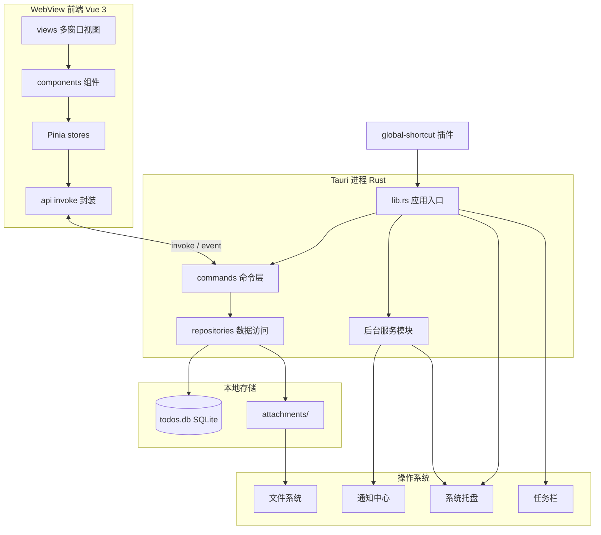
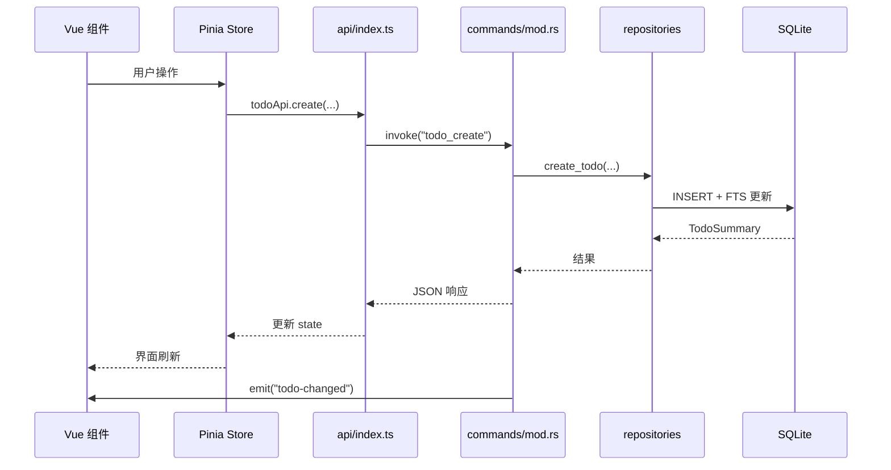
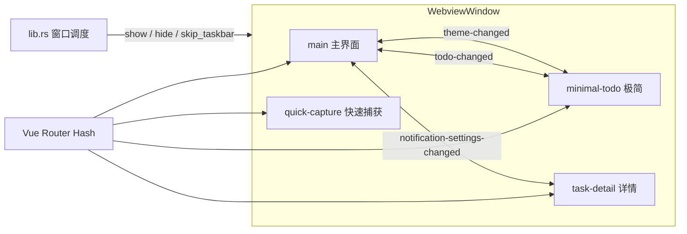
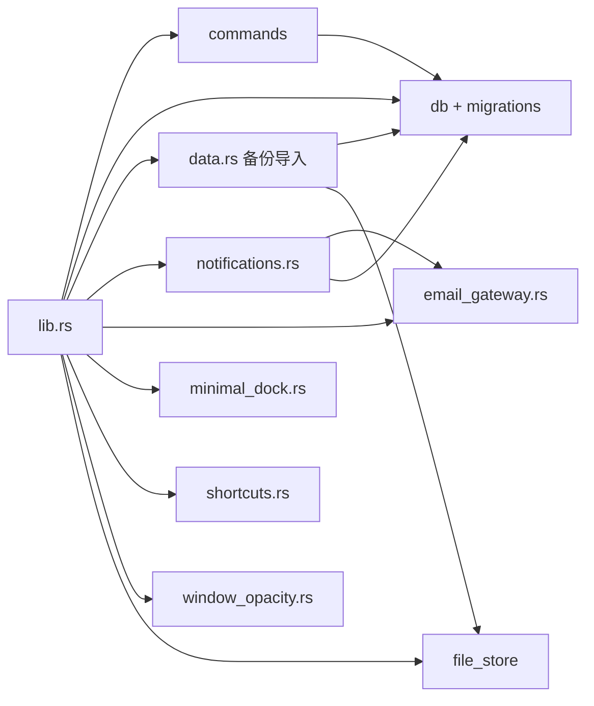

# Todo List

基于 **Tauri 2 + Vue 3 + TypeScript + Element Plus + SQLite** 的本地桌面待办工具。

**定位**：单人、本地、轻量——不依赖账号与云同步，适合日常任务记录与桌面快捷操作。

## 文档索引

| 文档 | 说明 |
|------|------|
| [Feature.md](./Feature.md) | 当前已实现的功能清单 |
| [Requirement.md](./Requirement.md) | 产品定位与需求说明 |
| [Requirement-AI.md](./Requirement-AI.md) | AI 可选增强模块需求（规划中） |
| [Plan.md](./Plan.md) | 后续打磨与进阶规划 |
| [Improvement.md](./Improvement.md) | 改善项备忘（开发向） |

## 功能速览

- 任务全生命周期：创建、编辑、完成、置顶、软删除、回收站恢复
- 组织方式：分类、标签、优先级、截止日期、负责人、列表 / 看板双视图
- 表达能力：TipTap 富文本、附件（图片 / PDF / Office / 文本）
- 搜索：SQLite FTS5 + jieba 中文分词，支持组合筛选
- 桌面集成：系统托盘、单实例、全局快捷键、快速捕获、极简模式（边缘吸附）
- 提醒：系统通知、邮件通知（SMTP）、可配置提前提醒与重复频率
- 数据：Zip 备份 / 恢复、JSON 导出 / 导入
- 个性化：浅色 / 深色 / 跟随系统、中英文、窗口透明度、可自定义快捷键

完整列表见 [Feature.md](./Feature.md)。

## 技术栈

| 层级 | 技术 |
|------|------|
| 前端 | Vue 3、TypeScript、Vite、Element Plus、Pinia、Vue Router、TipTap、vue-i18n |
| 桌面 | Tauri 2（Rust） |
| 数据 | rusqlite、SQLite FTS5、jieba-rs |
| 插件 | global-shortcut、notification、window-state、single-instance、opener |

**存储路径**（Windows 示例）：

- 数据库：`%APPDATA%/com.tx.todo-list/todos.db`
- 附件：`attachments/{todo_id}/`

## 快速开始

### 环境要求

- Node.js 18+
- [Rust 工具链](https://www.rust-lang.org/learn/get-started)
- Windows：[WebView2](https://developer.microsoft.com/microsoft-edge/webview2/)（Win10/11 通常已预装）

### 安装与开发

```bash
npm install --legacy-peer-deps
npm run tauri dev
```

### 生产构建

```bash
npm run tauri build
```

产物位于 `src-tauri/target/release/bundle/`。

## 项目结构

```
src/                          # Vue 前端
  api/                        # Tauri invoke 封装
  components/
    layout/                   # 主界面、列表、看板、详情、极简列表
    settings/                 # 设置对话框各分区
    editor/                   # TipTap 编辑器
    attachment/               # 附件面板与预览
    todo/                     # 快速输入、新建对话框等
  composables/                # 自动保存、通知、撤销删除等
  i18n/locales/               # 中文 / 英文文案
  stores/                     # Pinia 状态
  views/                      # 多窗口路由视图
src-tauri/
  src/
    commands/                 # Tauri Commands
    db/migrations/            # SQLite 迁移 (001–009)
    db/repositories/          # 数据访问层
    data.rs                   # 备份 / 恢复 / JSON 导入导出
    notifications.rs          # 到期提醒调度
    email_gateway.rs          # SMTP 邮件网关
    minimal_dock.rs           # 极简模式边缘吸附
    shortcuts.rs              # 全局快捷键
    file_store/               # 附件读写
  capabilities/               # Tauri 权限配置
```

## 架构说明

应用采用 **Tauri 双进程模型**：Vue 3 前端运行在系统 WebView 中，业务逻辑与持久化由 Rust 原生层负责。整体为**本地优先、分层清晰、多窗口共享同一前端工程**的桌面架构。

### 设计要点

| 原则 | 实现方式 |
|------|----------|
| 本地优先 | SQLite + 本地附件目录，核心功能不依赖网络 |
| 前后端分离 | UI 只通过 `invoke` 调用 Tauri Command，不直接访问数据库 |
| 单进程多窗口 | 一个 Rust 进程、多个 `WebviewWindow`，Hash 路由区分视图 |
| 跨窗口一致 | Pinia Store + Tauri Event 同步主题、语言、通知等设置 |
| 桌面原生能力 | 托盘、全局快捷键、系统通知、窗口状态等由 Rust 侧集成 |
| 可扩展 | 邮件网关、（规划中的 AI 网关）以独立模块挂载于 Rust 层 |

### 系统总览



### 请求链路（以任务为例）

用户操作经 Vue 组件进入 Pinia Store，再通过 `api/index.ts` 发起 `invoke`；Rust `commands` 校验参数后调用 `repositories`，最终读写 SQLite 或附件目录。变更完成后后端可 `emit` 事件，各窗口监听并刷新 UI。



### 多窗口与事件

四个窗口共用同一份前端构建产物，通过路由加载不同根视图。窗口显隐由 Rust（`lib.rs`）统一调度；部分设置类状态通过事件在多窗口间同步。



| 事件 | 用途 |
|------|------|
| `todo-changed` | 任务增删改后刷新各窗口列表 |
| `theme-changed` | 主题模式同步 |
| `locale-changed` | 语言切换同步 |
| `window-opacity-changed` | 窗口透明度同步 |
| `notification-settings-changed` | 通知设置同步 |
| `todo-due-reminder` | 后端推送到期提醒至前端 |
| `minimal-dock-animating` | 极简吸附动画状态 |

### Rust 模块职责



| 模块 | 职责 |
|------|------|
| `lib.rs` | 应用启动、托盘、多窗口创建与切换、插件注册 |
| `commands/` | 对外暴露的 Tauri Command，参数序列化与错误转换 |
| `db/repositories/` | SQL 与 FTS 查询、事务、业务数据组装 |
| `file_store/` | 附件落盘、读取、`local://` URL 解析 |
| `notifications.rs` | 60s 轮询到期任务、系统通知、邮件联动 |
| `email_gateway.rs` | SMTP 配置持久化、测试邮件、到期邮件 |
| `minimal_dock.rs` | 极简窗口边缘吸附、失焦缩边、位置记忆 |
| `shortcuts.rs` | 全局快捷键注册与持久化 |
| `data.rs` | Zip 备份/恢复、JSON 导出/导入 |
| `window_opacity.rs` | 跨窗口透明度读写与应用 |

### 前端分层

| 层级 | 目录 | 职责 |
|------|------|------|
| 视图 | `views/` | 窗口级页面：`MainView`、`MinimalTodoView` 等 |
| 组件 | `components/` | 可复用 UI：列表、看板、详情、设置分区 |
| 组合逻辑 | `composables/` | 自动保存、应用内通知、撤销删除等 |
| 状态 | `stores/` | Pinia：任务、分类、主题、通知、邮件等 |
| 接口 | `api/` | 对 Rust Command 的类型化封装 |
| 国际化 | `i18n/` | 中英文文案与 `vue-i18n` 配置 |

### 数据流与存储

- **结构化数据**：任务、分类、标签、看板列、设置 → `todos.db`（WAL 模式，版本化迁移 001–009）
- **全文索引**：FTS5 虚拟表 + `jieba-rs` 中文分词，由触发器与 Repository 维护
- **二进制附件**：`app_data_dir/attachments/{todo_id}/`，数据库仅存元数据与 `local://` 引用
- **设置项**：键值存入 `settings` 表（主题、快捷键、通知、邮件网关等）

更完整的产品能力说明见 [Feature.md](./Feature.md)；规划中的 AI 模块架构见 [Requirement-AI.md](./Requirement-AI.md)。

## 多窗口说明

应用通过 Hash 路由在同一前端工程中承载多个窗口：

| 路由 | 窗口 | 用途 |
|------|------|------|
| `/` | `main` | 主界面（三栏布局） |
| `/minimal` | `minimal-todo` | 极简任务列表 |
| `/quick-capture` | `quick-capture` | 全局快速添加 |
| `/task-detail/:id` | `task-detail` | 独立任务详情 |

## 快捷键

### 可自定义（设置 → 快捷键）

| 默认按键 | 功能 |
|----------|------|
| `Ctrl+Shift+N` | 打开快速捕获窗口 |
| `Ctrl+Shift+H` | 主窗口 / 极简模式切换 |

### 应用内固定

| 按键 | 功能 |
|------|------|
| `Enter` | 快速输入栏创建任务 |
| `Shift+Enter` | 创建并打开详情 |
| `Esc` | 快速捕获取消 |

## 数据库迁移

| 版本 | 内容 |
|------|------|
| 001 | categories、tags、todos、todo_tags |
| 002 | attachments |
| 003 | FTS5 虚拟表与触发器 |
| 004 | settings |
| 005 | assignee（负责人） |
| 006 | FTS 中文分词（jieba） |
| 007 | 修复 FTS porter 配置 |
| 008 | quadrant（四象限，字段保留） |
| 009 | kanban_columns、看板列关联 |

## 使用说明

- **关闭主窗口 / 极简窗口**：隐藏到系统托盘，不退出应用；托盘右键可退出
- **极简模式**：窄条任务列表，可吸附屏幕左右边缘；切换后不占任务栏图标
- **回收站**：软删除任务可恢复；永久删除会清理对应附件目录
- **备份**：设置 → 数据，支持 Zip 备份与恢复、JSON 导出与导入（合并模式）

## 许可证

见项目根目录许可证文件（如有）。
