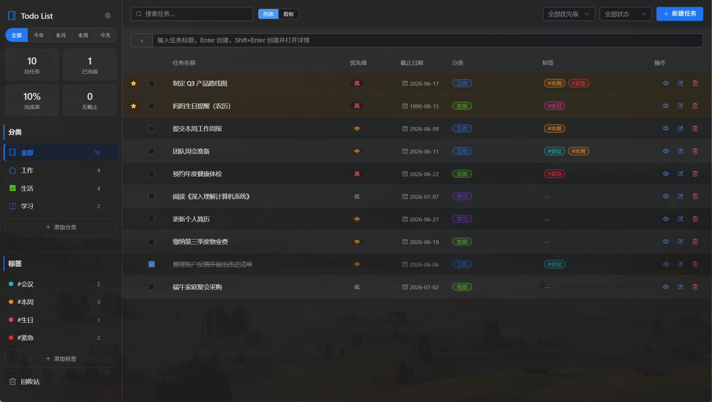
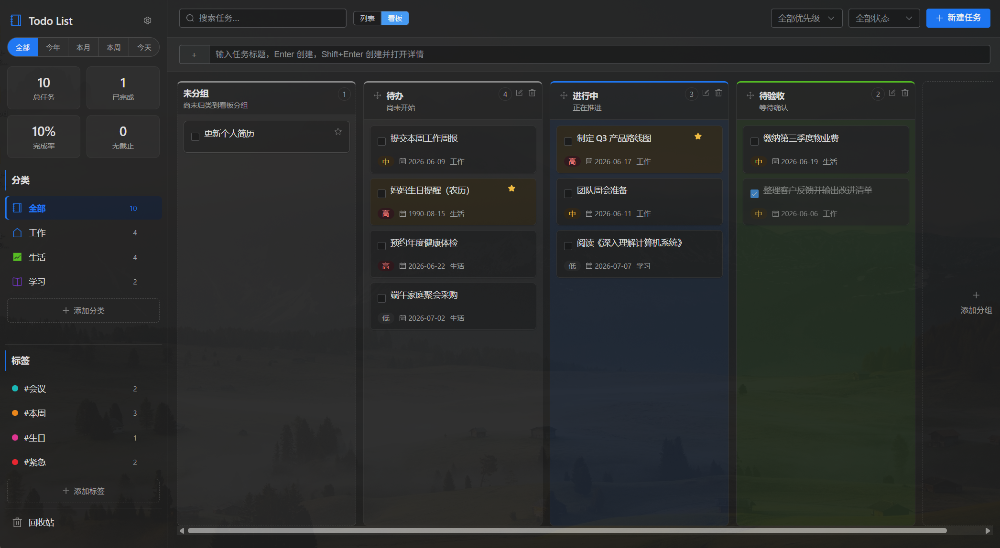
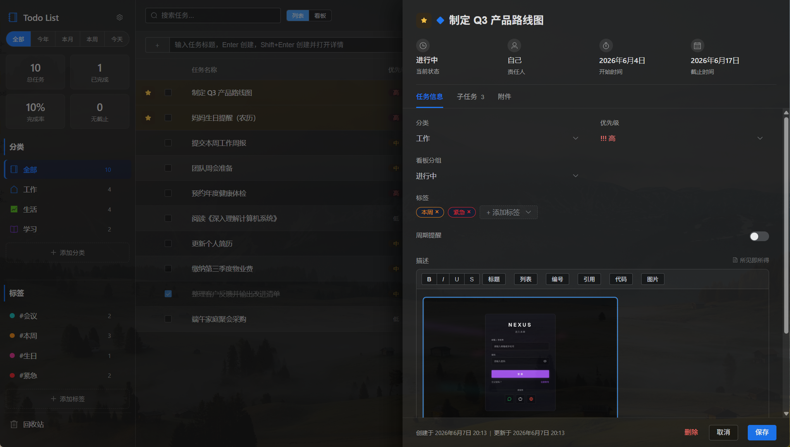
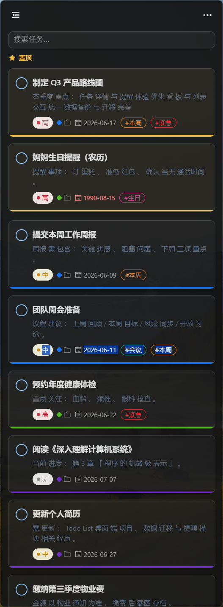
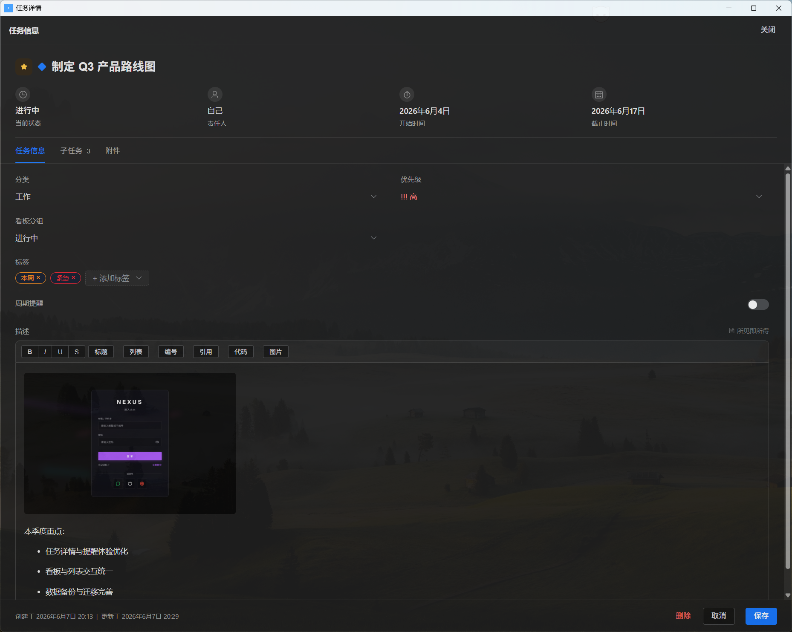

# Todo List

[](./LICENSE)
[](https://github.com/yuxiaoyong/Todo-List)
[](https://tauri.app)
[](https://vuejs.org)

基于 **Tauri 2 + Vue 3 + TypeScript + Element Plus + SQLite** 的本地桌面待办工具。

> **English**: A lightweight, local-first desktop todo app with list/kanban views, rich-text details, lunar/solar recurrence reminders, and edge-docked minimal mode. No account or cloud sync required. MIT licensed.

**定位**：单人、本地、轻量——不依赖账号与云同步，适合日常任务记录与桌面快捷操作。

---

## 下载安装

**Windows 用户**推荐从 [Releases](https://github.com/yuxiaoyong/Todo-List/releases) 下载预编译安装包（`.msi` / `.exe`），无需自行编译。

| 项目 | 说明 |
|------|------|
| 支持系统 | **Windows 10 / 11**（主要开发与测试平台） |
| 运行时 | [WebView2](https://developer.microsoft.com/microsoft-edge/webview2/)（Win10/11 通常已预装） |
| 其他平台 | 可尝试 `npm run tauri build` 自行编译，**功能未充分验证** |

若 Releases 暂无对应版本，请参考下方 [从源码构建](#从源码构建)。

---

## 界面预览

### 主界面 · 列表视图

分类、标签、优先级筛选与任务列表一览。



### 主界面 · 看板视图

按待办、进行中、待验收等列拖拽管理任务进度。



### 主界面 · 任务详情

三栏布局内嵌编辑，支持富文本、子任务、开始 / 截止日与周期提醒。



### 极简模式

窄条置顶列表，吸附屏幕边缘随手查阅。



### 独立详情窗口

独立窗口编辑，开始/截止时间、附件与提醒配置。



---

## 功能速览

- 任务全生命周期：创建、编辑、完成、置顶、软删除、回收站恢复
- 组织方式：分类、标签、优先级、开始 / 截止日期、负责人、列表 / 看板双视图
- 子任务：详情内增删改、勾选完成、进度展示
- 周期提醒：公历重复（日 / 周 / 月 / 季 / 年）、农历年度重复与节日预设，可锚定开始日或截止日
- 表达能力：TipTap 富文本、附件（图片 / PDF / Office / 文本）
- 搜索：SQLite FTS5 + jieba 中文分词，支持组合筛选
- 桌面集成：系统托盘、单实例、全局快捷键、快速捕获、极简模式（边缘吸附）
- 提醒：系统通知、邮件通知（SMTP）、到期与周期提醒、可配置提前提醒与重复频率
- 数据：Zip 备份 / 恢复、JSON 导出 / 导入、演示数据一键重置
- 个性化：浅色 / 深色 / 跟随系统、中英文、窗口透明度、可自定义快捷键

完整列表见 [Feature.md](./docs/Feature.md)；路线图见 [Plan.md](./docs/Plan.md)。

---

## 平台支持与已知限制

### 平台支持

| 能力 | Windows | macOS / Linux |
|------|---------|---------------|
| 核心任务管理 | ✅ | ⚠️ 未充分测试 |
| 系统 Toast 通知 | ✅ | ❌ 未实现 |
| 极简边缘吸附 | ✅ | ⚠️ 部分逻辑有 fallback |
| 窗口透明度 | ✅ | ⚠️ 未充分测试 |

### 已知限制（非目标）

以下能力**当前不提供**或**不完整**，请勿当作已有功能：

- 云同步、多人协作、账号体系
- 日历视图、命令面板（`Ctrl+K`）、任务模板
- 搜索关键词高亮
- 分类 / 标签侧边栏重命名与颜色编辑
- 免打扰时段；Rust 层通知 / 托盘文案暂为中文
- 自动备份、数据库损坏恢复引导

---

## 隐私与数据

- **本地优先**：任务、附件、设置均保存在本机，核心功能不依赖网络
- **无遥测**：不收集使用数据，不上传任务内容
- **邮件可选**：仅在用户配置 SMTP 后，于到期时发送提醒邮件；凭据存于本地 `settings` 表
- **数据目录**：Windows 下为 `%APPDATA%/com.tx.todo-list/`（可在设置 → 数据中打开）

---

## 从源码构建

### 环境要求

- Node.js 18+
- [Rust 工具链](https://www.rust-lang.org/learn/get-started)
- Windows：[WebView2](https://developer.microsoft.com/microsoft-edge/webview2/)

### 安装与开发

```bash
git clone https://github.com/yuxiaoyong/Todo-List.git
cd Todo-List
npm install --legacy-peer-deps
npm run tauri dev
```

### 生产构建

```bash
npm run tauri build
```

产物位于 `src-tauri/target/release/bundle/`。

### 演示数据（可选）

关闭应用后执行：

```bash
cd src-tauri
cargo run --bin seed-demo
```

详见 [demo-data.md](./docs/demo-data.md)。

---

## 使用说明

- **关闭主窗口 / 极简窗口**：隐藏到系统托盘，不退出应用；托盘右键可退出
- **极简模式**：窄条任务列表，可吸附屏幕左右边缘；切换后不占任务栏图标
- **回收站**：软删除任务可恢复；永久删除会清理对应附件目录
- **备份**：设置 → 数据，支持 Zip 备份与恢复、JSON 导出与导入（合并模式）
- **周期提醒**：任务详情 → 提醒，可配置公历或农历重复；完成后可选自动推进下一周期

### 快捷键

**可自定义**（设置 → 快捷键）：

| 默认按键 | 功能 |
|----------|------|
| `Ctrl+Shift+N` | 打开快速捕获窗口 |
| `Ctrl+Shift+H` | 主窗口 / 极简模式切换 |

**应用内固定**：

| 按键 | 功能 |
|------|------|
| `Enter` | 快速输入栏创建任务 |
| `Shift+Enter` | 创建并打开详情 |
| `Esc` | 快速捕获取消 |

---

## 常见问题

<details>
<summary><strong>npm install 报错或依赖冲突？</strong></summary>

请使用 `npm install --legacy-peer-deps`。部分 TipTap 相关 peer 依赖版本范围较宽，需要此标志。
</details>

<details>
<summary><strong>启动提示缺少 WebView2？</strong></summary>

前往 [Microsoft WebView2 运行时](https://developer.microsoft.com/microsoft-edge/webview2/) 下载并安装 Evergreen Bootstrapper。
</details>

<details>
<summary><strong>系统通知不弹出？</strong></summary>

1. 确认 设置 → 通知 中总开关与「系统通知」已开启
2. 检查 Windows 通知中心是否允许 Todo List
3. 确认任务已设置截止日或启用了周期提醒
</details>

<details>
<summary><strong>数据存在哪里？如何迁移？</strong></summary>

数据位于 `%APPDATA%/com.tx.todo-list/`（含 `todos.db` 与 `attachments/`）。可通过 设置 → 数据 进行 Zip 备份 / 恢复或 JSON 导出 / 导入。
</details>

<details>
<summary><strong>seed-demo 会覆盖现有数据吗？</strong></summary>

会。`cargo run --bin seed-demo` 会用演示快照**替换**当前数据库，请先备份。
</details>

---

## 参与贡献

欢迎提交 Issue 与 Pull Request！请先阅读 [CONTRIBUTING.md](./CONTRIBUTING.md)。

- [报告 Bug / 提建议](https://github.com/yuxiaoyong/Todo-List/issues)
- 架构与代码结构见 [ARCHITECTURE.md](./docs/ARCHITECTURE.md)

---

## 文档索引

| 文档 | 说明 |
|------|------|
| [Feature.md](./docs/Feature.md) | 当前已实现的功能清单 |
| [Plan.md](./docs/Plan.md) | 后续打磨与进阶规划 |
| [ARCHITECTURE.md](./docs/ARCHITECTURE.md) | 架构、模块、迁移与数据流 |
| [CONTRIBUTING.md](./CONTRIBUTING.md) | 贡献指南 |
| [Requirement.md](./docs/Requirement.md) | 产品定位与需求说明 |
| [Requirement-AI.md](./docs/Requirement-AI.md) | AI 可选增强模块（规划中） |
| [Improvement.md](./docs/Improvement.md) | 改善项备忘（开发向） |
| [demo-data.md](./docs/demo-data.md) | 演示数据说明与重置方法 |

---

## 许可证

[MIT License](./LICENSE) · Copyright (c) 2026 yuxiaoyong
