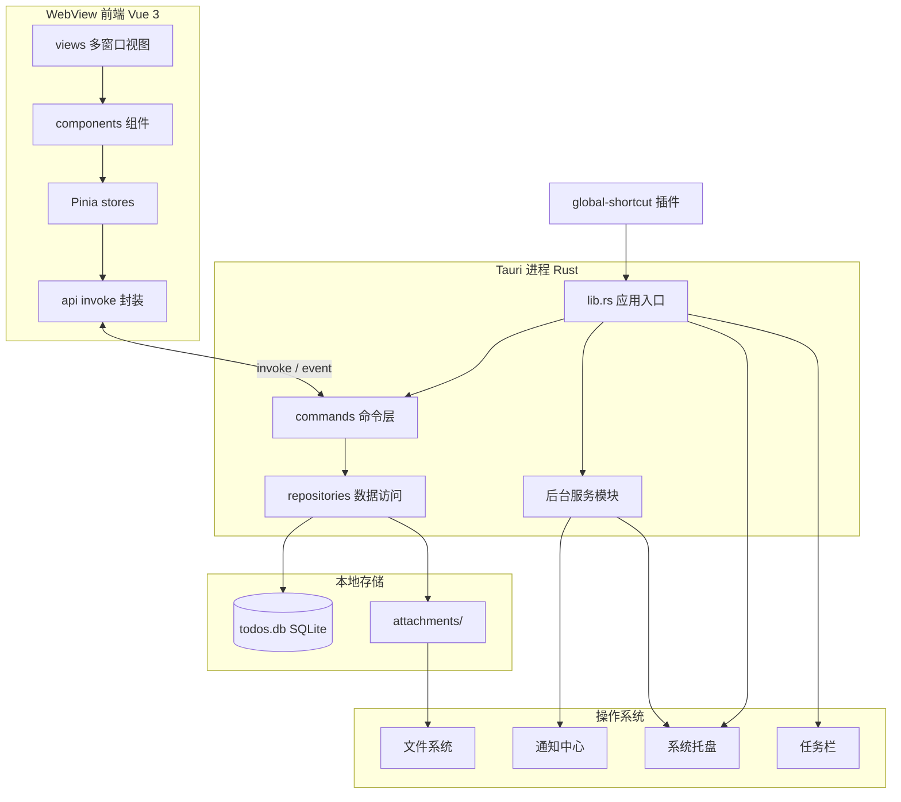
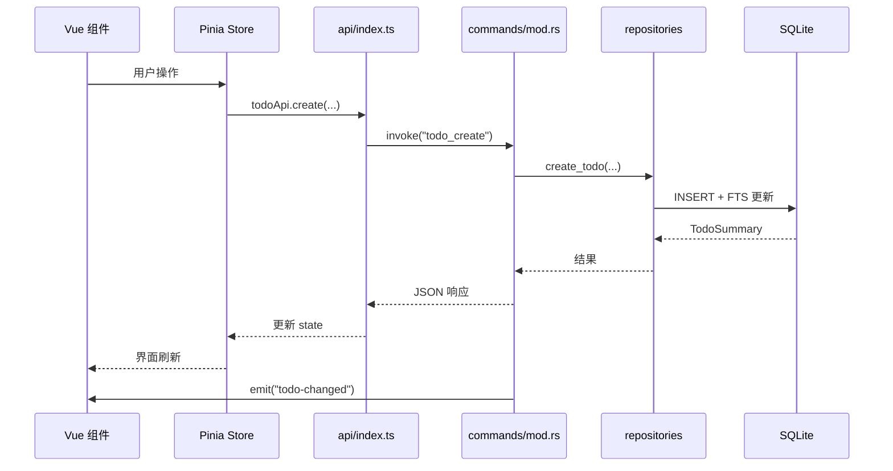
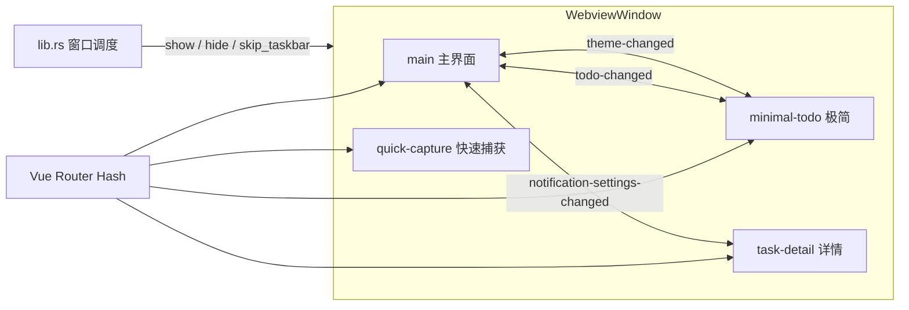
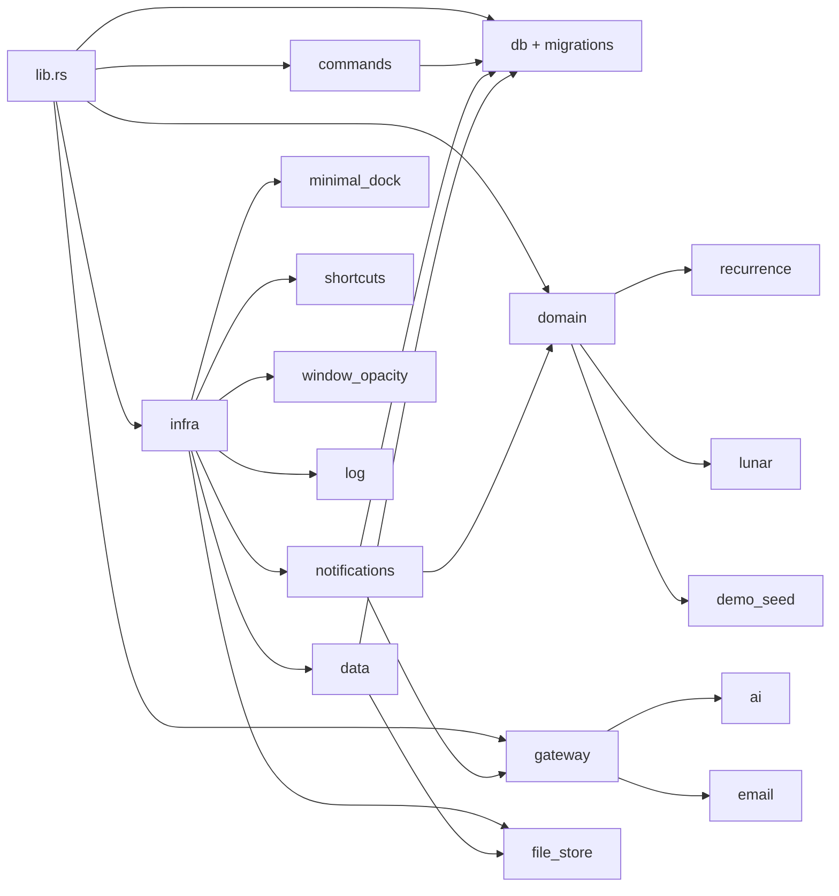
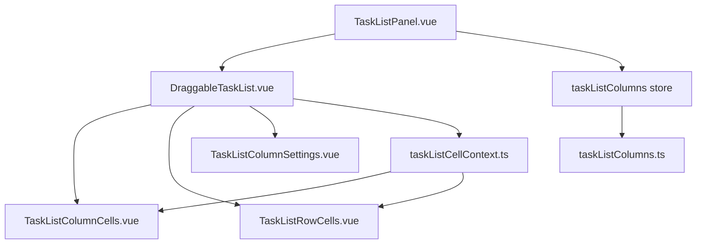

# 架构说明

> 本文档面向希望阅读或贡献代码的开发者。产品功能见 [Feature.md](./Feature.md)。

应用采用 **Tauri 双进程模型**：Vue 3 前端运行在系统 WebView 中，业务逻辑与持久化由 Rust 原生层负责。整体为**本地优先、分层清晰、多窗口共享同一前端工程**的桌面架构。

## 设计要点

| 原则         | 实现方式                                                                                 |
| ------------ | ---------------------------------------------------------------------------------------- |
| 本地优先     | SQLite + 本地附件目录，核心功能不依赖网络                                                |
| 前后端分离   | UI 只通过 `invoke` 调用 Tauri Command，不直接访问数据库                                  |
| 单进程多窗口 | 一个 Rust 进程、多个 `WebviewWindow`，Hash 路由区分视图                                  |
| 跨窗口一致   | Pinia Store + Tauri Event 同步主题、透明度、通知等；语言等自 settings 表各窗口初始化加载 |
| 桌面原生能力 | 托盘、全局快捷键、系统通知、窗口状态等由 Rust 侧集成                                     |
| 可扩展       | 邮件 / AI 网关、周期 / 农历等领域逻辑以独立 Rust 模块挂载                                |

## 系统总览



## 请求链路（以任务为例）

用户操作经 Vue 组件进入 Pinia Store，再通过 `api/index.ts` → `utils/tauriInvoke.ts` 发起 `invoke`；Rust `commands` 校验参数后调用 `repositories`，最终读写 SQLite 或附件目录。变更完成后后端可 `emit` 事件，各窗口监听并刷新 UI。

写入失败时，`tauriInvoke` 会弹出 `ElMessage` 并将错误写入 `app.log`；应用启动时还会调用 `app_health_check` 检测数据目录可写与数据库读写。



## 多窗口与事件

四个窗口共用同一份前端构建产物，通过 Hash 路由加载不同根视图。窗口显隐由 Rust（`lib.rs`）统一调度；部分设置类状态通过事件在多窗口间同步。

| 路由               | 窗口            | 用途               |
| ------------------ | --------------- | ------------------ |
| `/`                | `main`          | 主界面（三栏布局） |
| `/minimal`         | `minimal-todo`  | 极简任务列表       |
| `/quick-capture`   | `quick-capture` | 全局快速添加       |
| `/task-detail/:id` | `task-detail`   | 独立任务详情       |



| 事件                            | 用途                           |
| ------------------------------- | ------------------------------ |
| `todo-changed`                  | 任务增删改后刷新各窗口列表     |
| `theme-changed`                 | 主题模式同步                   |
| `window-opacity-changed`        | 窗口透明度同步                 |
| `notification-settings-changed` | 通知设置同步                   |
| `todo-due-reminder`             | 后端推送到期 / 周期提醒至前端  |
| `task-detail-navigate`          | 通知点击后切换独立详情窗口任务 |
| `minimal-dock-animating`        | 极简吸附动画状态               |

## Rust 模块职责

Rust 源码按职责分为四层：`commands`（对外接口）、`db`（持久化）、`domain`（纯业务规则）、`gateway`（外部 HTTP 服务）、`infra`（桌面集成与 I/O）。



| 模块 / 目录           | 职责                                           |
| --------------------- | ---------------------------------------------- |
| `lib.rs`              | 应用启动、托盘、多窗口创建与切换、插件注册     |
| `commands/`           | 对外暴露的 Tauri Command，参数序列化与错误转换 |
| `db/repositories/`    | SQL 与 FTS 查询、事务、业务数据组装            |
| `domain/recurrence.rs`| 公历 / 农历周期下次发生时刻计算                |
| `domain/lunar.rs`     | 农历 ↔ 公历换算、闰月与节日辅助                |
| `domain/demo_seed.rs` | 从 `demo/demo-data.json` 写入演示数据          |
| `gateway/ai.rs`       | OpenAI 兼容 / Ollama HTTP 网关                 |
| `gateway/email.rs`    | SMTP 配置持久化、测试邮件、到期邮件            |
| `infra/notifications.rs` | 60s 轮询到期与周期任务、系统通知、邮件联动  |
| `infra/file_store/`   | 附件落盘、读取、`local://` URL 解析            |
| `infra/minimal_dock.rs` | 极简窗口边缘吸附、失焦缩边、位置记忆         |
| `infra/shortcuts.rs`  | 全局快捷键注册与持久化                         |
| `infra/data.rs`       | Zip 备份/恢复、JSON 导出/导入                  |
| `infra/window_opacity.rs` | 跨窗口透明度读写与应用                     |
| `infra/log.rs`        | 启动自检与 `app.log` 写入                      |
| `infra/error.rs`      | 统一错误类型 `AppError` / `AppResult`          |

## 前端分层

| 层级     | 目录           | 职责                                                    |
| -------- | -------------- | ------------------------------------------------------- |
| 视图     | `views/`       | 窗口级页面：`MainView`、`MinimalTodoView` 等            |
| 组件     | `components/`  | 可复用 UI：列表、看板、甘特、详情、子任务、周期提醒、设置分区 |
| 组合逻辑 | `composables/` | 自动保存、应用内通知、撤销删除等                        |
| 状态     | `stores/`      | Pinia：任务、分类、主题、通知、邮件等                   |
| 接口     | `api/`         | 对 Rust Command 的类型化封装                            |
| 国际化   | `i18n/`        | 中英文文案与 `vue-i18n` 配置                            |

## 项目结构

```
src/                          # Vue 前端
  api/                        # Tauri invoke 封装（调用 tauriInvoke）
  components/
    layout/                   # 主界面、列表、看板、甘特、详情、子任务、提醒、极简列表
    settings/                 # 设置对话框各分区
    editor/                   # TipTap 编辑器
    attachment/               # 附件面板与预览
    todo/                     # 快速输入、新建对话框等
  composables/                # 自动保存、通知、撤销删除、启动自检等
  utils/                      # tauriInvoke、周期提醒、农历、排序、筛选等
  i18n/locales/               # 中文 / 英文文案
  stores/                     # Pinia 状态
  views/                      # 多窗口路由视图
demo/
  demo-data.json              # 演示数据快照
src-tauri/
  src/
    commands/                 # Tauri Commands
    db/migrations/            # SQLite 迁移 (001–011)
    db/repositories/          # 数据访问层
    domain/                   # 领域逻辑：周期、农历、演示数据
    gateway/                  # 外部服务：AI、SMTP 邮件
    infra/                    # 桌面集成：通知、备份、附件、快捷键、日志等
    bin/seed-demo.rs          # 演示数据 CLI
  capabilities/               # Tauri 权限配置
```

## 列表视图实现

主界面列表**未使用** Element Plus `el-table`，而是自 v0.1.0 起基于 `DraggableTaskList.vue` + `vue-draggable-plus` 的自定义表格布局。原因：

| 考量 | 说明 |
| ---- | ---- |
| 行级拖拽排序 | 需整行作为 draggable 容器，`el-table` 行结构与此冲突 |
| 固定列 + 横向滚动 | 需左 / 中 / 右三区 sticky，表头与表体共享同一滚动容器 |
| 行内编辑 | 标题、分类、标签、日期等需在单元格内直接编辑，非只读展示 |
| 列显隐与顺序 | 用户可配置可见列及顺序，配置持久化到 `settings` 表 |

### 组件分工



| 文件 | 职责 |
| ---- | ---- |
| `TaskListPanel.vue` | 筛选、排序、回收站模式；`.table-wrap` 仅 `overflow: hidden`，纵向滚动交给列表内部 |
| `DraggableTaskList.vue` | 三区布局（`left` / `scroll` / `right`）、`ResizeObserver` 宽度、`vue-draggable-plus` 拖拽、sticky 表头 |
| `TaskListColumnCells.vue` | 表头单元格 |
| `TaskListRowCells.vue` | 表体单元格（含行内编辑） |
| `TaskListColumnSettings.vue` | 列设置 Popover（显隐、排序） |
| `taskListColumns.ts` | 列 ID、默认配置、宽度常量、左 / 右固定列划分 |
| `stores/taskListColumns.ts` | Pinia 状态，持久化键 `task_list_columns` |
| `taskListCellContext.ts` | `provide` / `inject` 共享编辑回调与样式上下文 |

### 布局模型

- **左固定区**（`pin`、`check`、`title`）：横向滚动时保持可见；标题列 `minmax(280px, 1fr)` 可伸展占满剩余宽度。
- **中间滚动区**（优先级、截止日、分类、标签等可选列）：列总宽超出容器时出现横向滚动条。
- **右固定区**（`actions`）：操作按钮列 sticky 于右侧。
- **列设置按钮**：叠在表头右侧（`position: sticky; right: 20px`），不属于表体行，避免与操作列错位。
- **纵向滚动**：仅 `.task-list-scroll` 滚动；表头 `position: sticky; top: 0` 随内容固定。

可选列 ID 与默认显隐见 `src/utils/taskListColumns.ts` 中 `DEFAULT_TASK_LIST_COLUMNS`。

## 数据流与存储

- **结构化数据**：任务、子任务、分类、标签、看板列、设置 → `todos.db`（WAL 模式，版本化迁移 001–011）
- **全文索引**：FTS5 虚拟表 + `jieba-rs` 中文分词，由触发器与 Repository 维护
- **二进制附件**：`app_data_dir/attachments/{todo_id}/`，数据库仅存元数据与 `local://` 引用
- **设置项**：键值存入 `settings` 表（主题、快捷键、通知、邮件网关等）

**存储路径**（Windows 示例）：

- 数据库：`%APPDATA%/com.tx.todo-list/todos.db`
- 附件：`%APPDATA%/com.tx.todo-list/attachments/{todo_id}/`
- 诊断日志：`%APPDATA%/com.tx.todo-list/app.log`

## 可靠性与诊断

| 机制             | 位置                                        | 作用                                                              |
| ---------------- | ------------------------------------------- | ----------------------------------------------------------------- |
| 启动自检         | `infra/log.rs` + `useAppBootstrap`          | 检测数据目录可写、SQLite 读写；失败时持久提示                     |
| 统一 invoke 封装 | `src/utils/tauriInvoke.ts`                  | 写入失败弹出错误、记录 `app.log`；读 settings 等可 `silent: true` |
| 弹窗层级         | `append-to-body` + `main.css` z-index       | 避免 WebView2 下设置 / 新建任务弹窗被遮挡无法点击                 |
| 首次启动演示数据 | `infra/data.rs`                             | 新建 `todos.db` 时自动导入示例数据                                |
| 演示数据 CLI     | `bin/seed-demo.rs`                          | 手动重置为演示快照（会覆盖现有数据）                              |

## 数据库迁移

| 版本 | 内容                                                     |
| ---- | -------------------------------------------------------- |
| 001  | categories、tags、todos、todo_tags（含 recurrence_json） |
| 002  | attachments                                              |
| 003  | FTS5 虚拟表与触发器                                      |
| 004  | settings                                                 |
| 005  | assignee（负责人）                                       |
| 006  | FTS 中文分词（jieba）                                    |
| 007  | 修复 FTS porter 配置                                     |
| 008  | quadrant（四象限，字段保留）                             |
| 009  | kanban_columns、看板列关联                               |
| 010  | subtasks（子任务）                                       |
| 011  | start_date（开始日期）                                   |

## 技术栈

| 层级        | 技术                                                                                         |
| ----------- | -------------------------------------------------------------------------------------------- |
| 前端        | Vue 3、TypeScript、Vite、Element Plus、Pinia、Vue Router、TipTap、vue-i18n、lunar-javascript |
| 桌面        | Tauri 2（Rust）                                                                              |
| 数据        | rusqlite、SQLite FTS5、jieba-rs                                                              |
| 农历 / 周期 | chinese-lunisolar-calendar（Rust）、lunar-javascript（前端预览）                             |
| 插件        | global-shortcut、notification、window-state、single-instance、opener                         |
| Windows     | winrt-toast-reborn（系统 Toast）                                                             |

AI 模块架构与实现状态见 [Requirement-AI.md](./Requirement-AI.md)、[Feature.md § 3.1](./Feature.md#31-ai-助手可选)。
