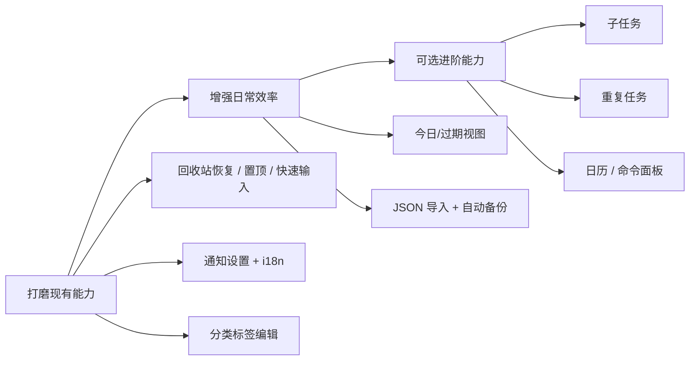

# Todo List 改善清单

> 定位：单人、本地、轻量的桌面效率工具  
> 最后更新：2026-06-05

---

## 当前已具备的能力

- **核心闭环**：创建 → 分类/标签/优先级/截止日 → 列表/看板 → 详情编辑 → 软删除/回收站
- **桌面集成**：系统托盘、单实例、窗口状态记忆、快速捕获、显示/隐藏主窗口
- **数据安全**：Zip 备份、恢复、JSON 导出
- **表达能力**：TipTap 富文本、附件、FTS 中文分词搜索
- **个性化**：浅色/深色/跟随系统主题、中英文、可自定义全局快捷键

对「一个人日常记任务」而言，主干已经可用。

---

## 一、半成品 / 打磨项（投入小、体感明显）

这些不是缺架构，而是**代码里已有能力但未接好**：

| 项 | 现状 | 建议 |
|---|---|---|
| **回收站恢复** | 后端有 `todo_restore`，UI 只有删除后 5 秒撤销 | 回收站列表加「恢复」按钮 |
| **置顶** | 数据库有 `pinned` 字段，排序也考虑了 | 列表/详情加星标置顶 |
| **快速输入栏** | `QuickInputBar.vue` 已写好但未挂载 | 挂到任务列表顶部，减少点「新建任务」 |
| **搜索高亮** | FTS 可用，样式类存在但未用 | 标题/摘要里高亮匹配词 |
| **通知设置** | 固定 60 秒轮询、每天一条、无开关 | 设置里加：开关、提前提醒、免打扰时段 |
| **通知多语言** | 前端已 i18n，Rust Toast 标题仍写死中文 | 按 `locale` 发不同文案 |
| **分类/标签管理** | 只能新建和删除 | 支持重命名、改颜色、排序 |
| **编辑器链接** | Link 扩展已加载 | 工具栏加插入/编辑链接 |
| **JSON 导入** | 只有导出 | 与导出对称，方便迁移/合并 |

> 预估：这类改动通常 1～3 天能明显提升「完成度」。

---

## 二、功能缺口（按优先级）

### 高优先级（直接影响每天用）

1. **回收站与误删安全感**  
   单人工具最怕误删。除恢复按钮外，可考虑「清空回收站」二次确认。

2. **到期提醒精细化**  
   - 目前：按**日期**、每天最多提醒一次  
   - 欠缺：具体时刻、提前 N 分钟/小时、今日任务独立入口、通知总开关

3. **「今天 / 即将到期」视图**  
   侧边栏有时间筛选，但缺少明确的「今日待办」「已过期」智能列表；`dueToday` API 已有，UI 未用。

4. **列表内拖拽排序**  
   看板可拖，列表不行；后端有 `todo_reorder` / `todo_reorder_positions`，列表视图未接。

5. **默认行为设置**  
   例如：默认分类、新建后是否打开详情、默认优先级——减少重复操作。

### 中优先级（提升长期效率）

6. **子任务 / 清单** — 大任务拆步骤  
7. **重复任务** — 周报、月付等周期性事项  
8. **日历视图** — 有截止日但无月历/周历总览  
9. **命令面板**（`Ctrl+K`）— 搜任务、新建、切视图、打开设置  
10. **任务模板** — 固定结构的重复事项（会议、周报等）  
11. **自动备份** — 每周/每次退出时 Zip，比手动备份更安心  
12. **JSON 导入 + 冲突策略** — 与导出配套，才算完整数据可迁移性

### 低优先级（可后置）

- 番茄钟 / 专注模式
- 统计趋势（完成率曲线、分类分布）
- 自然语言解析日期（「明天下午」）
- 多设备同步 / 端到端加密
- 插件体系

---

## 三、体验与产品层面

### 交互

- 详情抽屉关闭时未保存的提示（自动保存有，但用户不一定感知）
- 键盘导航：列表上下键、Enter 打开详情、Esc 关闭
- 空状态引导：无任务、无分类、回收站为空时的说明

### 性能与规模

- 任务上千条时：虚拟滚动、分页或懒加载
- 时间筛选目前在客户端做（`timeFilter.ts`），数据量大时应下沉到 SQL

### 可靠性

- 备份恢复失败时的更明确错误与回滚说明（部分已有）
- 启动时 DB 损坏检测与「从最近备份恢复」引导

### 文档

- 保持 README / Feature / Plan / ARCHITECTURE 与代码一致（列表视图、Rust 模块分层等）

### 代码整洁

- `TodoItem.vue` — 未使用，已被 `DraggableTaskList` 替代
- `highlightId` in ui store — 设置但未读取
- `todoApi.dueToday()` — API 存在但 UI 未调用

---

## 四、建议路线图

### 阶段 A：打磨包（约 1 周）

- [x] 回收站「恢复」按钮
- [x] 任务置顶 UI（`pinned` 字段）
- [x] 挂载 `QuickInputBar` 到 `TaskListPanel`
- [x] 设置 → 通知：开关、提前提醒
- [ ] Windows 通知标题跟随语言设置
- [ ] 分类/标签重命名与颜色

### 阶段 B：效率包（约 2～4 周）

- [ ] 侧边栏「今日」「已过期」入口
- [x] 列表拖拽排序
- [x] JSON 导入
- [ ] 定时/退出自动备份
- [ ] 设置：默认分类、新建行为

### 阶段 C：进阶包（按需）

- [ ] 子任务
- [ ] 重复任务
- [ ] 日历视图
- [ ] 命令面板 `Ctrl+K`

---

## 五、刻意不做（保持定位）

单人本地工具**不必**一开始就追 Todoist/Things 的全功能：

- 账号、云同步、多人协作、评论
- 过重的工作流/自动化引擎
- 复杂项目管理（依赖、工时）

---

## 六、成熟度自评

| 维度 | 完成度 |
|------|--------|
| 核心单人桌面 MVP | ~85% |
| 搜索与组织 | ~70% |
| 桌面集成 | ~80% |
| 数据安全（备份） | ~65% |
| 高级效率功能 | ~35% |

**结论**：当前已是可用的本地 Todo MVP；优先把「已有能力接满」和「误删安全感、今日视图、提醒可控、导入与自动备份」补齐，再考虑子任务、重复、日历等进阶能力。

---

## 相关文件索引

| 区域 | 路径 |
|------|------|
| 任务列表 | `src/components/layout/TaskListPanel.vue` |
| 任务详情 | `src/components/layout/TaskDetailPanel.vue` |
| 看板 | `src/components/layout/KanbanView.vue` |
| 侧边栏 | `src/components/layout/Sidebar.vue` |
| 快速输入（未挂载） | `src/components/todo/QuickInputBar.vue` |
| 通知 | `src-tauri/src/notifications.rs`、`src/composables/useDueNotifications.ts` |
| 设置 | `src/components/settings/SettingsDialog.vue` |
| 数据备份 | `src-tauri/src/data.rs`、`src/components/settings/SettingsDataSection.vue` |
| 国际化 | `src/i18n/`、`src/stores/locale.ts` |
| UI 状态 | `src/stores/ui.ts` |
| 后端仓库 | `src-tauri/src/db/repositories/mod.rs` |
