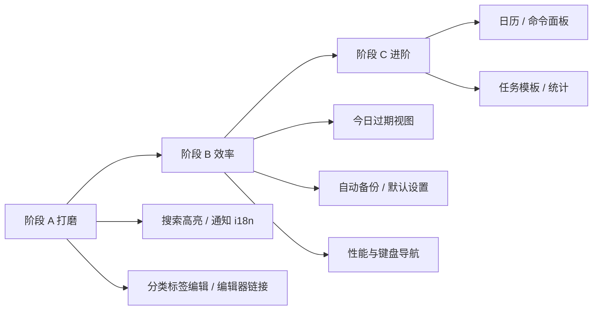

# 后续规划

> 最后更新：2026-06-15  
> 本文档描述**尚未完成**或**待加强**的改进项，按阶段排列。  
> 已实现内容见 [Feature.md](./Feature.md)。

---

## 当前成熟度（自评）

| 维度 | 完成度 | 说明 |
|------|--------|------|
| 核心单人桌面 MVP | ~92% | 任务闭环、列表 / 看板 / 甘特、极简、备份导入均已具备 |
| 搜索与组织 | ~75% | FTS 可用，列表列配置已完善，缺高亮与分类完整管理 UI |
| 桌面集成 | ~92% | 托盘、快捷键、极简吸附、任务栏隐藏成熟 |
| 提醒与通知 | ~78% | 通道与策略已有，缺 i18n 与免打扰 |
| 数据安全 | ~70% | 手动备份完善，缺自动化与损坏恢复 |
| 进阶效率功能 | ~55% | 子任务、重复、甘特、AI 基础已做；日历、命令面板未做 |

**综合评分（个人本地 Todo 定位）**：约 **8.0 / 10**

---

## 阶段 A：打磨包（约 1 周）

> 投入小、体感明显；多数是「能力已有但未接满」。

| 状态 | 项 | 说明 |
|------|-----|------|
| ✅ | 回收站恢复 UI | 列表 / 详情已支持恢复 |
| ✅ | 任务置顶 UI | 列表星标 + 极简置顶区 |
| ✅ | 快速输入栏 | 已挂载至 `TaskListPanel` |
| ✅ | 通知设置 | 总开关、系统 / 邮件、提前提醒、重复频率 |
| ✅ | 列表拖拽排序 | 主列表 + 极简列表 |
| ✅ | JSON 导入 | 设置 → 数据 |
| ⬜ | 搜索高亮 | FTS 结果中高亮匹配词（`.highlight-mark` 样式已预留） |
| ⬜ | 通知多语言 | Rust Toast / 邮件主题 / 托盘菜单跟随 `locale` |
| ⬜ | 分类 / 标签编辑 | 侧边栏支持重命名、改颜色、排序 |
| ⬜ | 编辑器链接 | TipTap 工具栏增加插入 / 编辑链接 |
| ⬜ | 文档同步 | 保持 README / Feature / Plan / ARCHITECTURE 与代码一致 |

### A 阶段完成后预期

- 日常「找任务、管分类、看提醒」体验无明显断层
- 英文界面下系统层文案不再夹杂中文
- 综合评分 → **~8.2**

---

## 阶段 B：效率包（约 2～4 周）

> 提升每天用起来的频率与长期安心感。

| 状态 | 项 | 说明 |
|------|-----|------|
| ⬜ | **今日 / 已过期视图** | 侧边栏智能入口；复用 `todo_due_today` 等 API |
| ⬜ | **默认行为设置** | 默认分类、新建后是否打开详情、默认优先级 |
| ⬜ | **免打扰时段** | 通知设置中增加时段，调度层跳过 |
| ⬜ | **自动备份** | 退出时或每周定时 Zip；可设置保留份数 |
| ⬜ | **导入冲突策略 UI** | 导入前可选跳过 / 覆盖规则，展示导入统计 |
| ⬜ | **时间筛选下沉 SQL** | `timeFilter.ts` 逻辑移至 Repository，减轻前端压力 |
| ⬜ | **虚拟滚动** | 任务上千条时列表 / 极简列表性能保障 |
| ⬜ | **键盘导航** | 列表 ↑↓、Enter 开详情、Esc 关闭面板 |
| ⬜ | **空状态引导** | 无分类、无标签、首次使用时的简短说明 |

### B 阶段完成后预期

- 打开应用第一眼即看到「今天要做什么」
- 用户不依赖手动备份也敢长期用
- 大数据量下仍流畅
- 综合评分 → **~8.5**

---

## 阶段 AI：智能辅助（可选，见 Requirement-AI.md）

> 与核心 Todo 解耦；建议在一期打磨（阶段 A）基本完成后再启动。

| 阶段 | 内容 | 状态 |
|------|------|------|
| AI-1 | 设置配置、云端 / Ollama、自然语言建任务 | ✅ |
| AI-2 | 多任务拆分、详情润色 / 拆解、分类标签建议 | 部分（子任务拆解 ✅） |
| AI-3 | 今日优先建议、语义搜索 | ⬜ |

完整需求见 [Requirement-AI.md](./Requirement-AI.md)。

---

## 阶段 C：进阶包（按需）

> 任务变复杂后再做；不抢在 A / B 之前。

| 项 | 说明 | 优先级 |
|----|------|--------|
| 日历视图 | 按截止日浏览月 / 周 | 中 |
| 命令面板 `Ctrl+K` | 搜任务、新建、切视图、打开设置 | 中 |
| 任务模板 | 会议、周报等固定结构一键创建 | 低 |
| 自然语言日期 | 「明天下午」解析为截止日（AI 建任务已部分覆盖） | 低 |
| 统计趋势 | 完成率、分类分布 | 低 |

> 子任务、周期提醒、甘特图、列表列配置等已在 v0.2.0 及后续迭代中实现，见 [Feature.md](./Feature.md)。

---

## 技术债清理（穿插进行）

| 项 | 说明 |
|----|------|
| 删除 `TodoItem.vue` | 已被 `DraggableTaskList` 替代 |
| `quadrant` 字段 | 评估是否迁移完成后删除列 |
| 测试补充 | Repository 层 FTS 已有单测；备份 / 导入 / 通知调度待补 |
| 错误反馈统一 | 部分 `catch` 仅 `console.error`，应对齐 `ElMessage` |
| DB 损坏检测 | 启动时校验 + 「从最近备份恢复」引导 |

---

## 刻意不做（保持定位）

以下能力**不在**路线图内，除非产品定位发生根本变化：

- 账号体系与云同步
- 多人协作与评论
- 复杂项目管理（依赖、工时）
- 插件生态
- 番茄钟 / 专注模式（可独立工具，不并入核心）

---

## 建议执行顺序（Next 3）

若资源有限，建议优先：

1. **今日 / 已过期侧边栏入口** — 最直接提升日活感知  
2. **通知 i18n + 免打扰** — 补齐桌面产品细节  
3. **自动备份** — 提升「敢长期用」的信任感  

---

## 相关文件

| 区域 | 路径 |
|------|------|
| 任务列表 | `src/components/layout/TaskListPanel.vue`、`DraggableTaskList.vue` |
| 列表列配置 | `src/utils/taskListColumns.ts`、`src/stores/taskListColumns.ts` |
| 侧边栏 | `src/components/layout/Sidebar.vue` |
| 通知调度 | `src-tauri/src/notifications.rs` |
| 数据备份 | `src-tauri/src/data.rs` |
| 设置 | `src/components/settings/SettingsDialog.vue` |
| 改善备忘 | [Improvement.md](./Improvement.md) |
