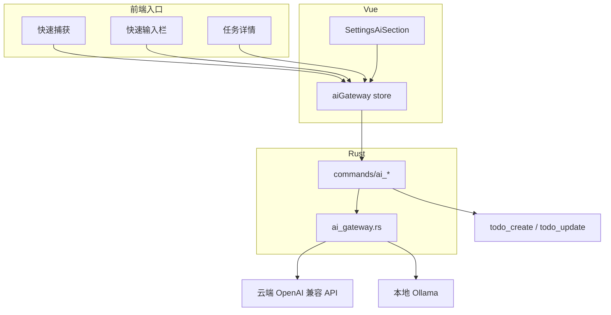

# AI 能力需求说明

> 最后更新：2026-06-05  
> 状态：**规划中，尚未实现**  
> 关联文档：[Requirement.md](./Requirement.md)（主产品需求）、[Plan.md](./Plan.md)（整体路线图）

---

## 1. 模块定位

AI 能力是 Todo List 的**可选增强模块**，不是核心依赖。

| 维度 | 要求 |
|------|------|
| 与主产品关系 | 增强录入与组织效率，不替代现有 CRUD / 搜索 / 提醒闭环 |
| 启用方式 | 默认关闭；用户在设置中主动开启并配置 |
| 离线要求 | 关闭 AI 或未配置时，应用 100% 离线可用 |
| 账号体系 | 无平台账号；用户自备 API Key 或本地推理服务 |
| 数据出境 | 由用户选择服务商与隐私级别；须明确告知 |

### 设计原则

1. **场景化，非聊天化**：不做独立 AI 对话主页，只在具体入口提供 AI 辅助
2. **建议可审阅**：AI 输出先预览，用户确认后再写入数据库
3. **对称于邮件网关**：配置存本地 settings，请求由 Rust 后端发起
4. **本地优先不变**：核心 Todo 能力不绑定任何云端 AI 服务

---

## 2. 目标场景

| 场景 | 用户输入示例 | 期望输出 |
|------|--------------|----------|
| 自然语言建任务 | 「明天下午 3 点开会讨论预算」 | 标题 + 截止日（+ 可选优先级） |
| 一段话拆多条 | 「买牛奶、回邮件、周五前交报告」 | 多条任务草稿列表 |
| 任务拆解 | 详情里点「AI 拆解」 | 子步骤清单（待确认后写入） |
| 分类 / 标签建议 | 新建任务后 | 基于现有分类 / 标签库给出建议 |
| 正文辅助 | 详情正文区 | 润色、扩写、生成简短摘要 |
| 今日优先级建议 | 打开今日视图 | 结合截止日与优先级推荐「先做哪几件」 |
| 语义搜索（远期） | 「上周那个报销相关的事」 | 返回语义相近任务（非仅关键词匹配） |

---

## 3. 服务商与接入模式

### 3.1 模式 A：云端 API（Should，一期）

| ID | 需求 | 验收标准 |
|----|------|----------|
| AI-P-01 | OpenAI 兼容接口 | 支持自定义 Base URL + API Key + Model |
| AI-P-02 | 预设服务商模板 | 至少提供「OpenAI 兼容」「DeepSeek」等常用模板（仅填 URL 差异） |
| AI-P-03 | 连接测试 | 设置页可发送测试请求并显示成功 / 失败 |
| AI-P-04 | 超时与错误 | 请求超时、401、429 等有可读错误信息 |

### 3.2 模式 B：本地推理（Should，一期或二期）

| ID | 需求 | 验收标准 |
|----|------|----------|
| AI-P-05 | Ollama 接入 | 默认 `http://127.0.0.1:11434`，可改地址与模型名 |
| AI-P-06 | 本地不可用提示 | 服务未启动时明确提示，不阻塞其他功能 |
| AI-P-07 | 数据不出本机 | 本地模式下请求不访问外网（除用户自行配置的地址） |

### 3.3 模式切换

| ID | 需求 | 验收标准 |
|----|------|----------|
| AI-P-08 | 互斥或分源配置 | 设置中可选择「云端」或「本地」作为当前提供方 |
| AI-P-09 | 默认关闭 | `ai.enabled = false` 时不显示任何 AI 入口 |

---

## 4. 功能需求

### 4.1 配置（Must）

| ID | 需求 | 验收标准 |
|----|------|----------|
| AI-C-01 | 设置分区 | 设置 → AI（与通知、邮件并列） |
| AI-C-02 | 总开关 | 启用 / 禁用 AI 能力 |
| AI-C-03 | API Key 存储 | 存于本地 `settings`；界面不明文回显完整 Key |
| AI-C-04 | 模型选择 | 可填模型名称；本地模式可拉取 Ollama 模型列表（可选） |
| AI-C-05 | 隐私级别 | 至少支持「仅标题」「标题 + 正文」两档发送范围 |
| AI-C-06 | 跨窗口同步 | 配置变更通过事件广播至多窗口 |

### 4.2 自然语言建任务（Must，一期）

| ID | 需求 | 验收标准 |
|----|------|----------|
| AI-F-01 | 快速捕获入口 | 快速捕获窗口支持「AI 解析」 |
| AI-F-02 | 快速输入入口 | 主界面快速输入栏支持「AI 解析」 |
| AI-F-03 | 结构化输出 | 模型返回 JSON：`title`、`dueDate?`、`priority?`、`categoryName?`、`tagNames?` |
| AI-F-04 | 预览确认 | 展示解析结果卡片，用户可编辑后确认创建 |
| AI-F-05 | 日期解析 | 支持「今天 / 明天 / 下周五 / 6 月 10 日」等相对与绝对表达 |
| AI-F-06 | 失败降级 | 解析失败时保留原文，用户可手动创建 |

### 4.3 多任务拆分（Should，一期）

| ID | 需求 | 验收标准 |
|----|------|----------|
| AI-F-07 | 批量草稿 | 一段输入拆成多条任务预览 |
| AI-F-08 | 选择性创建 | 用户可勾选要创建的任务条目 |
| AI-F-09 | 单条创建 | 拆分结果可逐条确认写入 |

### 4.4 任务详情辅助（Should，二期）

| ID | 需求 | 验收标准 |
|----|------|----------|
| AI-F-10 | 拆解子步骤 | 根据标题 / 正文生成子步骤列表（为子任务功能铺垫） |
| AI-F-11 | 正文润色 | 润色、精简、改语气（可选） |
| AI-F-12 | 生成摘要 | 长正文生成一行摘要填入描述或备注区 |
| AI-F-13 | 不自动覆盖 | 默认插入预览区或新段落，不静默覆盖用户正文 |

### 4.5 组织建议（Could，二期）

| ID | 需求 | 验收标准 |
|----|------|----------|
| AI-F-14 | 分类建议 | 基于现有分类列表推荐一项 |
| AI-F-15 | 标签建议 | 基于现有标签库推荐 0～N 个 |
| AI-F-16 | 优先级建议 | 输出 high / medium / low 及简短理由 |

### 4.6 智能视图（Could，三期）

| ID | 需求 | 验收标准 |
|----|------|----------|
| AI-F-17 | 今日建议 | 在「今日 / 即将到期」视图中展示 AI 推荐的优先处理顺序 |
| AI-F-18 | 语义搜索 | 除 FTS 外可选「语义搜索」模式（需 embedding，可本地或云端） |

---

## 5. 非功能需求

### 5.1 性能

| ID | 需求 |
|----|------|
| AI-NF-01 | 单次解析请求 UI 有 loading 状态，不冻结主界面 |
| AI-NF-02 | 支持请求超时（建议默认 30s，可配置） |
| AI-NF-03 | 流式输出为可选优化，一期可同步返回完整 JSON |

### 5.2 隐私与安全

| ID | 需求 |
|----|------|
| AI-NF-04 | 首次启用前展示简短隐私说明（数据发往何处） |
| AI-NF-05 | API Key 不出现在日志、崩溃报告、JSON 导出中 |
| AI-NF-06 | 用户可随时关闭 AI 并清除已存 Key |
| AI-NF-07 | 不向应用开发者自有服务器上传任务数据（无中转层） |

### 5.3 可靠性

| ID | 需求 |
|----|------|
| AI-NF-08 | 网络 / 服务失败不影响任务本地读写 |
| AI-NF-09 | 模型返回非 JSON 或字段缺失时有兜底解析或明确报错 |
| AI-NF-10 | 相同输入重复请求允许用户取消 |

### 5.4 可维护性

| ID | 需求 |
|----|------|
| AI-NF-11 | AI 逻辑集中在 `gateway/ai.rs`，与 `gateway/email.rs` 对称 |
| AI-NF-12 | Prompt 模板版本化，便于调整而不改业务 UI |
| AI-NF-13 | 用户可见文案支持 i18n（中 / 英） |

### 5.5 成本可控

| ID | 需求 |
|----|------|
| AI-NF-14 | 不在后台自动批量调用 AI（避免静默耗 Token） |
| AI-NF-15 | 所有 AI 调用均由用户显式触发 |

---

## 6. 技术架构（建议）

### 建议文件

| 区域 | 路径 |
|------|------|
| 后端网关 | `src-tauri/src/ai_gateway.rs` |
| Commands | `src-tauri/src/commands/mod.rs`（`ai_parse_task`、`ai_test_connection` 等） |
| 前端 Store | `src/stores/aiGateway.ts` |
| 设置 UI | `src/components/settings/SettingsAiSection.vue` |
| API 封装 | `src/api/index.ts` |

### 配置存储（建议键名）

| 键 | 说明 |
|----|------|
| `ai.enabled` | 总开关 |
| `ai.provider` | `cloud` / `ollama` |
| `ai.cloud.baseUrl` | API Base URL |
| `ai.cloud.apiKey` | API Key |
| `ai.cloud.model` | 模型名 |
| `ai.ollama.baseUrl` | Ollama 地址 |
| `ai.ollama.model` | 本地模型名 |
| `ai.privacy.sendContent` | 是否发送正文 |
| `ai.timeoutSecs` | 请求超时秒数 |

---

## 7. 实施阶段

### 阶段 AI-1（约 3～5 天）

- [ ] 设置 → AI 配置页（云端 + Ollama）
- [ ] `ai_gateway.rs` 基础请求与测试连接
- [ ] 快速捕获 / 快速输入：自然语言解析 → 预览 → 创建
- [ ] 隐私开关与 i18n 文案

**验收**：用户可用自己的 Key 完成「一句话建任务」。

### 阶段 AI-2（约 1～2 周）

- [ ] 多任务拆分
- [ ] 详情页：拆解子步骤、正文润色 / 摘要
- [ ] 分类 / 标签 / 优先级建议

**验收**：组织与表达类场景有明确 AI 入口且可审阅确认。

### 阶段 AI-3（按需）

- [ ] 今日优先建议
- [ ] 语义搜索（embedding + 向量检索或 API）

**验收**：与 Plan.md 中「今日视图」「语义搜索」目标对齐。

---

## 8. 刻意不做

以下不在 AI 模块范围内：

| 项 | 原因 |
|----|------|
| 独立 AI 聊天机器人窗口 | 偏离 Todo 工具定位 |
| 应用自有 AI 账号 / 订阅计费 | 引入账号与运维体系 |
| 开发者中转代理服务 | 破坏「数据不经第三方平台」预期 |
| 内置大模型安装包 | 安装体积与更新成本过高 |
| 自动后台分析全部任务 | Token 成本不可控、隐私风险大 |
| AI 自动修改 / 删除任务 | 误操作风险高，必须人工确认 |
| 多轮长对话上下文 | 复杂度高，与「轻量」冲突 |

---

## 9. 与主产品需求的关系

| 主需求（Requirement.md） | AI 模块如何补充 |
|--------------------------|----------------|
| 本地优先、离线可用 | AI 可选；关闭后零依赖 |
| 快速捕获（D-03） | 自然语言解析降低录入成本 |
| 搜索（O-04） | 远期语义搜索增强 FTS |
| 自然语言日期（Plan.md） | AI-F-05 直接覆盖 |
| 子任务（Plan.md C 阶段） | AI-F-10 拆解子步骤可作为前置体验 |
| 隐私（NF-07） | 本地 Ollama + 发送范围开关 |

---

## 10. 风险与对策

| 风险 | 对策 |
|------|------|
| 用户不愿把任务发到云端 | 提供 Ollama；默认仅发标题；隐私说明 |
| 模型输出不稳定 | 强制 JSON schema + 前端校验 + 预览确认 |
| API 费用 | 仅用户显式触发；不做后台批处理 |
| 增加设置复杂度 | 预设模板 + 测试连接 + 合理默认值 |
| 与核心功能耦合 | 独立模块、独立开关、独立文档 |

---

## 11. 术语表

| 术语 | 含义 |
|------|------|
| AI 网关 | Rust 层统一封装 LLM HTTP 请求的模块 |
| 结构化解析 | 将自然语言转为固定 JSON 字段而非自由文本 |
| OpenAI 兼容 | 使用 `/v1/chat/completions` 等通用接口格式 |
| Ollama | 本地运行开源模型的常见方式 |
| 预览确认 | AI 结果展示给用户编辑后再调用 `todo_create` |

---

## 12. 实现状态

| 类别 | 状态 |
|------|------|
| 需求定义 | ✅ 本文档 |
| 代码实现 | ⬜ 未开始 |
| Feature.md 收录 | ⬜ 待实现后更新 |
| Plan.md 纳入 | ⬜ 建议在阶段 C 前插入「阶段 AI」 |
